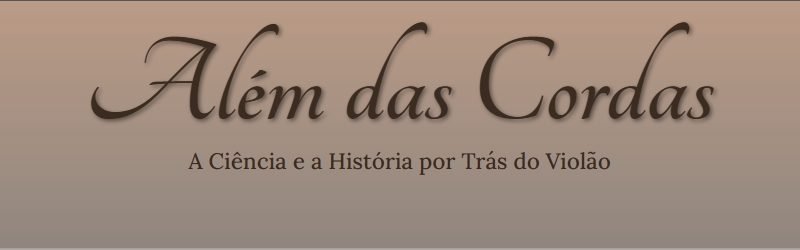

<div align="center">
   
</div>

## Além das Cordas 
**Um site dedicado à ciência, história e curiosidades sobre o violão.**

---

## 📌 Descrição
Projeto desenvolvido para explorar o universo do violão, desde suas origens históricas até técnicas modernas. O site combina um design elegante com conteúdo informativo, ideal para músicos, estudantes e entusiastas.

- **Linha do tempo histórica** - Do medieval ao violão moderno
- **Anatomia do violão** - Descubra como a madeira afeta o som e quais são utilizadas
- **Perfil de mestre** -   Compositor e professor brasileiro Paulinho Nogueira
- **Guia visual de tablaturas** - Aprenda a ler tabs com exemplos interativos

---

## 🛠️ Tecnologias Utilizadas


---

## 🔍 Como Visualizar o Projeto
1. Acesse via GitHub Pages: [Visualizar Site](https://gabrielpree.github.io/alemDasCordas/)
2. Ou clone localmente:
```bash
git clone https://github.com/seu-usuario/alem-das-cordas.git
cd alem-das-cordas
